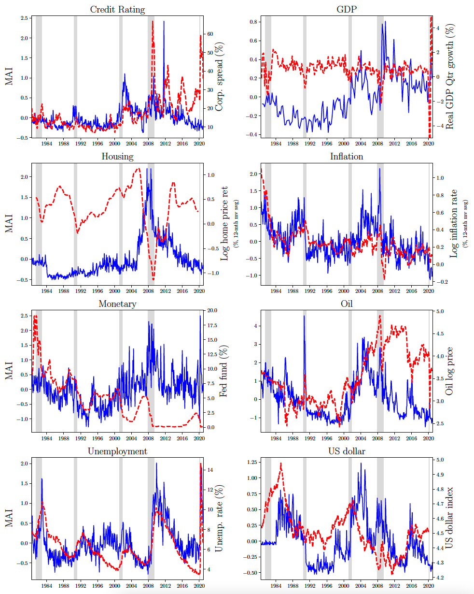

.. title: MAI
.. slug: mai
.. date: 2022-01-11 23:42:59 UTC-04:00
.. tags:
.. category:
.. link:
.. description:
.. type: text
.. hidetitle: true

Data for Macroeconomic Attention and Announcement Risk Premia
~~~~~~~~~~~~~~~~~~~~~~~~~~~~~~~~~~~~~~~~~~~~~~~~~~~~~~~~~~~~~

We provide the daily and monthly monthly macroeconomic attention indices for the New York Times and Wall Street Journal used in Fisher, Martineau, and Sheng (2021) "Macroeconomic Attention and Risk Premia" [`SSRN <https://papers.ssrn.com/sol3/papers.cfm?abstract_id=2703978>`__].

The data is available on [`GitHub <https://github.com/charlesmartineau/mai_rfs>`__]

- We have updated the monetary and unemployment indices to 2025. 

Columns ending with *_ni* and *_wi* corresponds to NYT and WSJ, respectively, and those without corresponds to the composite index. 

We also include the 3-day average (column MAI3) and the 3-day detrended MAI-Pre (column dMAI3) prior to Unemployment and FOMC announcements in *MAI_Unemployment_Announcement.csv* and *MAI_FOMC_Announcement.csv*. Note that computing the 3-day detrended MAI-Pre is not trivial due to the dynamic window length between announcements. The results reported in the paper are robust to simply taking the 3-day average prior to announcements. 

If you use this data, please cite our study accordingly:

Fisher, Martineau, and Sheng (2022), Macroeconomic Attention and Announcement Risk Premia, *Review of Financial Studies, Forthcoming*

